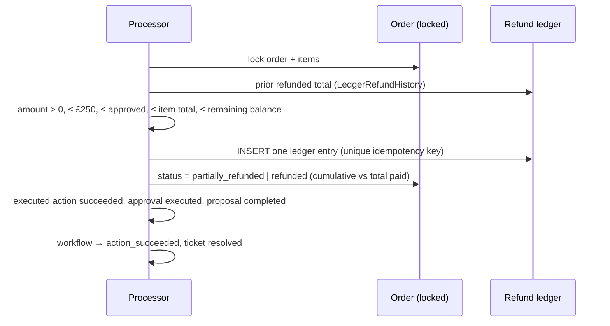

# Action execution

The worker executes exactly two **simulated** internal actions, resolved through a closed
registry — never by a handler name taken from a job payload.

| Proposed action | Internal action | Moves money | Changes order |
| --- | --- | --- | --- |
| `request_supervisor_refund_approval` | `simulated_refund` | ✅ | ✅ |
| `request_supervisor_cancellation_approval` | `simulated_order_cancellation` | ❌ | ✅ |

Any other proposal is **not** automatically executable: it is approved but routed to
`manual_action_required` with no job. The registry
([registry.py](../backend/app/actions/registry.py)) carries each handler's version, timeout,
maximum attempts, retryable technical codes and honest money/order flags.

## Handlers plan; the processor writes

A handler ([handlers.py](../backend/app/actions/handlers.py)) validates and **plans** an
action against the locked order — it performs no writes. It returns an
`ActionExecutionResult` describing the effect (reference, amount, new order status, result
JSON, summary). The processor ([processor.py](../backend/app/outbox/processor.py)) applies
every write in one atomic transaction. The context is deliberately **model-free**: the
worker never calls an LLM to decide whether an action may execute.

## Refund execution



Limits are recomputed **at execution time** against the ledger, so a prior refund reduces
the remaining balance. The **production refund-history adapter** is now
`LedgerRefundHistory` ([repository.py](../backend/app/actions/repository.py)), backed by the
refund ledger; the S2 `NoRefundHistory` stub remains only for deterministic unit tests. The
order row lock means two concurrent refunds on one order cannot both observe the same
balance and jointly exceed it — one waits, re-reads, and is blocked if it would overshoot.

Summary text is deliberately honest:

> A simulated refund of £59.00 was recorded in the AgentOps demonstration ledger.

## Cancellation execution

An order is cancellable only while `placed`, `paid` or `processing`, with the shipment
absent or `label_created`. If the order shipped, was delivered, or is already cancelled, the
cancellation is **not** applied.

```mermaid
sequenceDiagram
    participant P as Processor
    participant O as Order (locked)
    P->>O: lock order + shipment
    P->>P: status in {placed,paid,processing}? shipment absent or label_created?
    alt cancellable
        P->>O: status = cancelled
        P->>P: executed action succeeded, workflow → action_succeeded
    else shipped/delivered/cancelled after approval
        P->>P: no effect; workflow → manual_action_required
    end
```

> The order was cancelled in the AgentOps demonstration environment.

## Changed preconditions

When an order **ships after approval but before execution**, the worker does not cancel it.
The attempt is non-retryable, the job is marked failed, the approval becomes
`execution_failed`, the proposal stays uncompleted, and the workflow moves to
`manual_action_required` with reason `order_shipped_before_execution` — a return flow is
recommended. The failure remains fully inspectable via the outbox and attempt APIs.

## Failure classification

| Kind | Examples | Worker action |
| --- | --- | --- |
| Retryable technical | transient DB fault, lost lease, injected fault | back off + retry, then dead-letter |
| Precondition changed | order shipped / delivered / already cancelled | manual handling (non-retryable) |
| Non-retryable business | expired approval, tampering, over-limit, cross-customer, unsupported | fail; workflow `action_failed` |
| Duplicate success | idempotency key already executed | **idempotent success**, not an error |

Only technical failures may be retried by a Supervisor
([approval-system.md](approval-system.md)); a snapshot tamper, ownership mismatch,
over-limit refund, shipped order, expired approval or unsupported action never retries.

## Never claimed

No production endpoint executes an action. Execution happens only in the worker. An
environment-gated `POST /api/dev/outbox/process-one` runs one worker tick for demos and is
absent (404) outside development/test.
