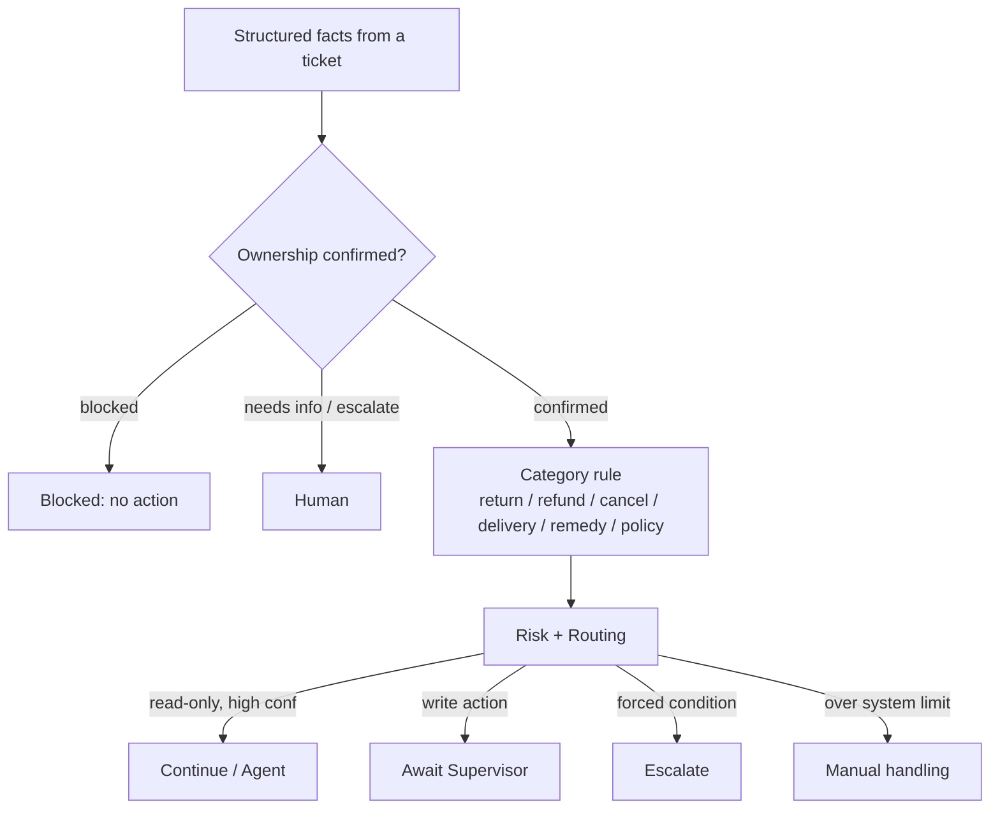

# Business Rules (S2)

The deterministic rules engine is the **final authority** for ownership, eligibility,
limits, risk and escalation. It runs with no LLM, no network and no external API. A
future AI stage may understand language and *propose* actions, but it can never override
these results.

## Authority boundary: AI vs deterministic code

| The AI (later) may | The deterministic layer (now) decides |
| --- | --- |
| Classify a ticket, extract identifiers, draft a reply, propose **one** action | Ownership, all eligibility, refund limits, risk band, required approver, routing, whether execution is permitted |

The AI's proposal is an *input* to routing, never a bypass. `execution_permitted` is
**always `false` in S2** — nothing is executed here.

## Clock and date semantics

All time flows through an injected `Clock` (`app/rules/clock.py`); rules never call
`datetime.now()`. `SystemClock` is used at runtime, `FixedClock` in tests and the demo
CLI. All datetimes are timezone-aware UTC.

| Rule | Basis | Boundary |
| --- | --- | --- |
| Returns | calendar date | inclusive: eligible through `delivered_at.date() + 30 days` (day 30 eligible, day 31 not) |
| Damaged / incorrect remedy | calendar date | 30 days inclusive |
| Delivery delay | calendar date | `days_late = today − promised_date`; `<=0` on time |
| Policy validity | calendar date | `effective_from <= today <= effective_to` (or open-ended) |
| Refund / cancellation / ownership / routing | no time input | — |

## Rule result model

Every rule returns a `RuleResult` (`app/rules/models.py`), serialisable and free of
secrets/ORM entities:

`outcome`, `eligible`, `risk_level`, `route`, `reason_codes[]`, `explanations[]`,
`computed{}` (integer pennies/counts), `evidence[]`, `policy_evidence[]`,
`missing_information[]`, `approval_required`, `execution_permitted`, `rule_version`,
`idempotency_key?`, and (routing only) `required_role`, `may_propose`.

Enums (`app/rules/enums.py`):

- **DecisionOutcome:** `eligible, ineligible, needs_information, requires_review, requires_approval, escalate, blocked`
- **RiskLevel:** `read_only, low, medium, high, blocked`
- **Route:** `continue_processing, await_agent, await_supervisor, needs_information, escalate, manual_handling, blocked`
- **ApprovalRole:** `none, agent, supervisor`

## Threshold table (frozen)

| Threshold | Value |
| --- | --- |
| Return / remedy window | 30 calendar days, inclusive |
| Refund Medium risk | `<= £50.00` (5 000 p) |
| Refund High risk | `£50.01–£250.00` (5 001–25 000 p) |
| Refund Blocked (manual finance) | `> £250.00` (25 000 p) |
| Delivery minor delay | 1–3 days late |
| Delivery significant delay | 4–9 days late |
| Delivery severe delay (escalate) | `>= 10` days late |
| Confidence: continue | `>= 0.75` |
| Confidence: agent review | `0.50–0.74` |
| Confidence: escalate | `< 0.50` |

## Implemented rules

- **Ownership** (`ownership-v1`) — ambiguous → escalate; unresolved → needs_information; order owned by another customer → **blocked** (never silently swapped).
- **Returns** (`returns-v1`) — delivery required; 30-day inclusive window; already-returned ineligible; change-of-mind needs unused item; damaged/incorrect are packaging-exempt.
- **Refunds** (`refund-v1`) — positive amount; `<= item line total`; `<= remaining order balance` (`total_paid − prior_refunds`); supported basis; standard returns need the item received; all refunds need Supervisor; amount bands set risk; carries the idempotency key + `DUPLICATE_CHECK_REQUIRED`.
- **Cancellations** (`cancellation-v1`) — only `placed/paid/processing` with shipment absent or `label_created`; shipped/delivered → return flow; already-cancelled is an idempotent ineligible result; High risk, Supervisor.
- **Delivery delay** (`delivery-delay-v1`) — tiers above; handles delivered/lost/exception/not-shipped/missing-date.
- **Missing delivery** (`missing-delivery-v1`) — delivered-but-disputed → **always escalate, no auto remedy**; lost → remedy eligible (Supervisor); exception → review; in-transit → tracking only.
- **Damaged / incorrect remedy** (`damaged-remedy-v1`, `incorrect-remedy-v1`) — 30-day window; Supervisor remedy; incorrect item with unknown/unverifiable SKU → escalate (customer text is evidence, not trusted data).
- **Policy validity** (`policy-v1`) — exactly one active, in-date version authorises; expired/superseded/future cannot; multiple active → **conflict, escalate**; returns policy evidence (ids, version, dates, status).
- **Routing** (`routing-v1`) — see below.

## Routing model

Precedence: **ownership block → forced escalation → blocked-risk action → confidence
gate → missing information → approval mapping**.

Forced escalation (regardless of confidence): prompt injection, >1 customer match, >1
order match, delivered-but-disputed, policy conflict, no supporting policy for a
consequential action, unknown category, dependency failure, unverifiable incorrect item.

Approval mapping: information → none; internal ticket-status → Agent; return/replacement/
refund/cancellation → Supervisor; blocked → no in-system approval can permit execution.

## Reason-code catalogue

Stable `ReasonCode` values (analytics- and test-friendly) grouped by area: ownership,
returns, refunds, cancellations, delivery delay, missing delivery, remedies, policy and
routing. See `app/rules/enums.py` for the authoritative list; every code in the S2
specification is present.

## Idempotency

`sha256(ticket_id | action_type | order_id | amount_pence)` with `|` separators,
lowercased UUIDs, a normalised action type and a `none` sentinel when no amount applies.
Deterministic and free of timestamps/model text. No duplicate DB check happens in S2;
the result flags that one is required before execution.

## Examples

- **Refund £59 damaged, delivered:** `requires_approval`, High risk, `await_supervisor`, `REFUND_ELIGIBLE + REFUND_HIGH_RISK + REFUND_SUPERVISOR_APPROVAL_REQUIRED`, idempotency key set.
- **Return delivered day 31:** `ineligible`, `RETURN_WINDOW_EXPIRED`.
- **Cross-customer order:** `blocked`, `ORDER_OWNERSHIP_MISMATCH + CROSS_CUSTOMER_ACCESS_BLOCKED`.
- **High confidence + injection:** `escalate`, `INJECTION_FORCED_ESCALATION`.

## Known limitations

- No semantic policy retrieval yet (S3); policy validity operates on a topic's versions.
- No refund history persistence yet; prior refunds are supplied via `RefundHistoryPort`
  (a no-refunds adapter is used for the current seed).
- Routing needs a classification confidence; seeded tickets have none yet (no AI stage),
  so routing escalates them by design while eligibility is still fully computed.
