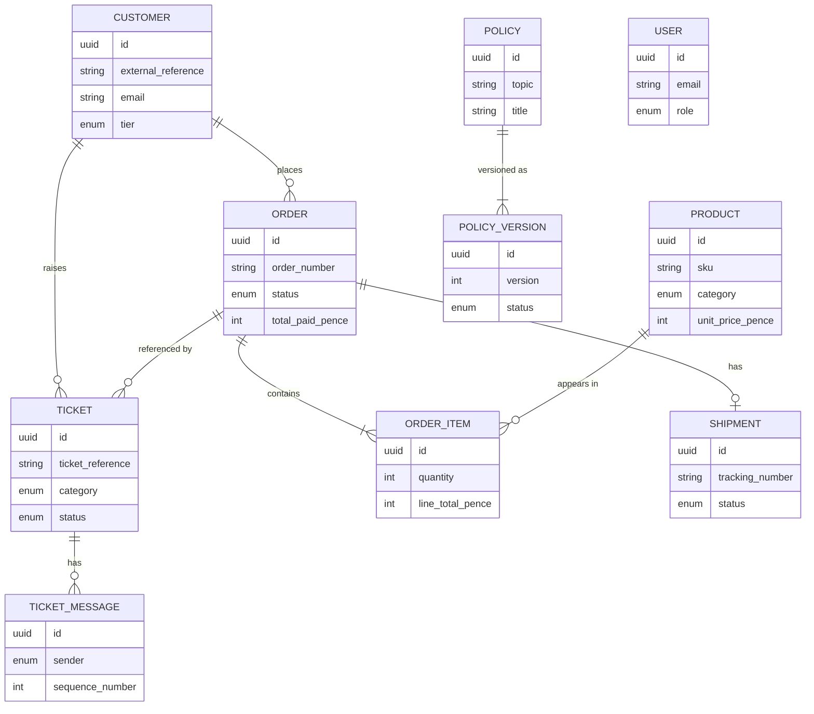

# Domain Model — Meridian & Co.

AgentOps supports **Meridian & Co.**, a fictional UK online homeware and lifestyle
retailer (kitchenware, home décor, bedding and towels, small furniture, consumer
accessories). GBP only, UK domestic delivery only, physical goods only, one shipment
per order. All data is synthetic.

This document describes the S1 persistence model. No AI, workflow, approval or
evaluation logic exists yet.

## Entities

| Entity | Purpose | Notable fields |
| --- | --- | --- |
| **User** | Support staff (Support Agent / Supervisor) who will later authenticate. | `email` (unique), `role`, `hashed_password` (never exposed), `is_active` |
| **Customer** | Synthetic customer. | `external_reference` (unique), `email` (unique), `phone`, `tier` |
| **Product** | Catalogue item. | `sku` (unique), `category`, `unit_price_pence`, `is_active` |
| **Order** | A customer purchase. | `order_number` (unique), `status`, money fields in pence, `placed_at` |
| **OrderItem** | A line on an order. | `quantity`, `unit_price_pence`, `line_total_pence`, `is_returned` |
| **Shipment** | Delivery record (≤1 per order). | `carrier`, `tracking_number` (unique), `status`, dates |
| **Ticket** | Support ticket. | `ticket_reference` (unique), `category`, `status`, `injection_flag`, `seed_tag` |
| **TicketMessage** | A message on a ticket (immutable). | `sender`, `body`, `is_trusted`, `sequence_number` |
| **Policy** | A policy topic. | `topic` + `title` (unique together) |
| **PolicyVersion** | A dated, versioned policy body. | `version`, `status`, `body`, `effective_from/to` |

### Enums

`UserRole`, `CustomerTier`, `ProductCategory`, `OrderStatus`, `ShipmentStatus`,
`TicketStatus`, `TicketCategory`, `TicketPriority`, `MessageSender`, `PolicyStatus` —
all stored as **native PostgreSQL enum types**.

## Conventions

- **Primary keys**: application-generated UUIDs (stable, non-guessable).
- **Timestamps**: timezone-aware `created_at` / `updated_at` maintained by the database
  (`TicketMessage` is immutable and has only `created_at`).
- **Money**: integer **pennies** everywhere (`*_pence`). No floating point.

## Important constraints (enforced in the database)

- Unique: user/customer email, customer external reference, product SKU, order number,
  tracking number, ticket reference, `(policy topic, title)`, `(policy_id, version)`,
  `(order_id, product_id)`, `(ticket_id, sequence_number)`.
- Money: all money fields `>= 0`; `order.total_paid_pence = subtotal + delivery_fee -
  discount`; `order_item.line_total_pence = quantity * unit_price_pence`;
  `product.unit_price_pence > 0`.
- Shipment: a delivered shipment **must** have `delivered_at`; a non-delivered shipment
  **must not**; `delivered_at >= shipped_at` when both are present.
- Ticket: `classification_confidence` in `[0, 1]` when present.
- TicketMessage: non-empty body; `sequence_number >= 1`.
- PolicyVersion: `effective_to > effective_from` when set; `version >= 1`.

## Ownership boundary

An order belongs to exactly one customer. A ticket may reference a customer and an
order, and when it references both, the order must belong to that customer. This is a
cross-row invariant, so it is enforced in the seed generator and the data-integrity
check rather than by a single-column constraint. Order-scoped repository queries
(`OrderRepository.search_for_customer`, `list_for_customer`) always filter by customer
so one customer's data cannot leak into another's.

## Delete strategy

- **RESTRICT** on financially/operationally sensitive links: `order.customer_id`,
  `order_item.product_id`, `ticket.customer_id`, `ticket.order_id`. You cannot delete a
  customer who has orders, etc.
- **CASCADE** for genuine child records: `order_item.order_id`, `shipment.order_id`,
  `ticket_message.ticket_id`, `policy_version.policy_id`.
- **Soft deactivation** (`is_active`) for users and products instead of deletion.

## Entity–relationship diagram

## Deferred tables (later stages)

The workflow, tool-call, model-call, prompt-version, approval, executed-action,
outbox, audit and evaluation tables from the MVP specification are **intentionally not
created in S1**. Their exact columns firm up when the features are built (S5–S8);
creating them now with speculative columns would invite repeated destructive
migrations. `pgvector` is enabled but no vector columns exist yet (they belong to the
RAG stage, S3).
