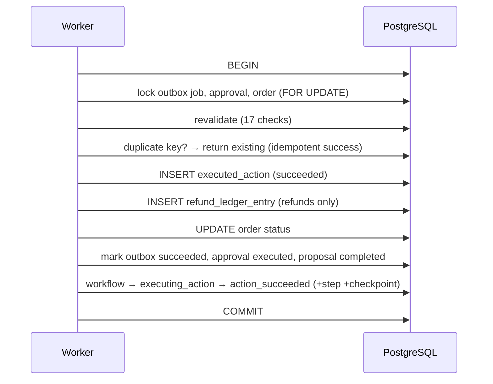

# Exactly-once semantics

AgentOps queues consequential actions **at least once** and applies their business effects
**exactly once**. The queue is allowed to deliver a job more than once (crashes, lease
expiry, competing workers); the *effect* — a refund ledger entry, an order-status change —
happens once and only once.

> Every effect in S6 is **simulated**. No payment processor, carrier, store or email
> service is ever contacted. References like `SIM-REF-2026-000001` are demonstration ids.

## The protection layers

Exactly-once is not one trick; it is a stack of independent guarantees, each of which
alone prevents a duplicate:

| Layer | Guarantee |
| --- | --- |
| `uq_outbox_idempotency_key` | One outbox job per business action |
| `uq_outbox_per_approval` | One job per approval |
| `uq_executed_actions_idempotency` | One executed action per business action |
| `uq_executed_actions_outbox` | One executed action per job |
| `uq_ledger_idempotency` | One refund-ledger entry per business action |
| Order row lock (`SELECT … FOR UPDATE`) | Serialises concurrent refunds on one order |
| Approval status check (`execution_pending`) | A decided/failed approval can't re-run |
| Workflow-state check | A terminal run can't execute again |
| Single execution transaction | Effect + completion commit together, or not at all |

The **business idempotency key** (`act-<sha256[:32]>` over action type + order + amount) is
the spine: it is unique on the outbox job, the executed action and the ledger entry, so the
same business action cannot produce two effects anywhere in the system.

## Idempotent reprocessing

When a worker picks up a job whose idempotency key already has a committed executed action,
it does **not** re-run the effect:

```
worker → load payload → executed action exists for key?
  yes → mark job succeeded (if needed), finish attempt, return DUPLICATE
  no  → revalidate → apply effect + completion in one transaction
```

No second ledger entry, no second order-status change, no second workflow transition.

## Time-of-check / time-of-use

Approval authorises an *attempt*, never the effect. Immediately before applying anything,
the worker re-reads freshly-locked rows and re-checks 17 conditions
([revalidation.py](../backend/app/actions/revalidation.py)): approval still
`execution_pending`, snapshot/payload hashes valid, proposal still
`approved_pending_execution`, workflow executable and not cancelled, ownership intact,
policy versions unchanged, and no existing effect for the key. A world that changed between
approval and execution (order shipped, approval expired, payload tampered) is caught here.

## The single execution transaction



Everything after the duplicate check is one transaction. A crash before `COMMIT` leaves the
database exactly as it was; the job's lease expires and it is safely reclaimed and retried —
the reprocess either finds no effect (and applies it once) or finds the committed effect
(and is idempotent).

## Crash points

The crash-point tests ([test_outbox_execution.py](../backend/tests/test_outbox_execution.py),
[test_outbox_worker.py](../backend/tests/test_outbox_worker.py)) cover: before claim commit,
after claim, after attempt-start, after executed-action insert, after ledger insert before
commit, before outbox-success update, after commit before acknowledgement, and lease
renewal. In every case the invariant holds: **no duplicate refund, no duplicate
cancellation, no lost committed action.**

See also [outbox-worker.md](outbox-worker.md) and [action-execution.md](action-execution.md).
