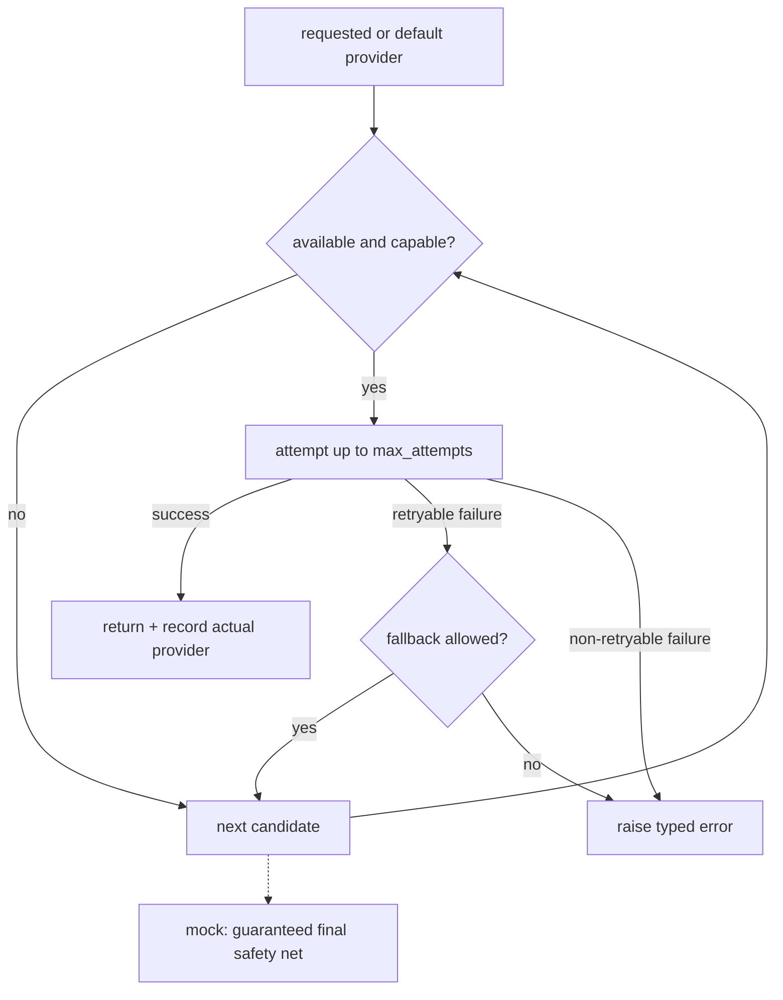

# Model Providers (S4)

A provider-neutral model layer. Application code depends only on the `ModelProvider`
Protocol (`app/llm/providers/base.py`), never on a vendor SDK.

## Provider interface

```python
class ModelProvider(Protocol):
    provider_name: str
    default_model: str
    capabilities: ProviderCapabilities
    def is_available(self) -> bool: ...
    async def generate(self, request: ModelRequest) -> ModelResponse: ...
```

`ModelRequest`/`ModelResponse` (`app/llm/models.py`) are the low-level, provider-neutral
types. Failures are raised as `ModelProviderError` carrying a stable `ModelErrorCode`; raw
provider exceptions never reach API/tool consumers.

## Capability model

Each provider declares capabilities (`native_structured_outputs`, `json_mode`,
`token_usage`, `request_ids`, `system_messages`, `temperature`, `seed`, …). The service and
router branch on capability, not provider name. When token usage is unavailable it is an
explicitly-labelled **estimate**, never presented as exact.

## Providers

| Provider | Default | Needs network | Needs secret | Cost |
| --- | --- | --- | --- | --- |
| **mock** (`mock.py`) | yes | no | no | zero (`zero_mock`) |
| **ollama** (`ollama.py`) | no | local Ollama | no | zero (`zero_local`, excludes hardware) |
| **hosted** (`hosted.py`) | no | yes | API key (env only) | estimated from price table |

### Deterministic mock

The default for CI, tests, offline evaluation and demos. It is **not** a language model and
never pretends to be one: it reads a compact `mock_payload` (JSON in `trace_metadata`) that
the task layer fills with the minimal structured facts, and synthesises a valid structured
output by explicit rules — classification by keyword, identifiers by regex, everything else
by faithfully reflecting the supplied deterministic context. Failure/malformed scenarios are
injected via `trace_metadata["mock_scenario"]` (`timeout`, `unavailable`, `rate_limited`,
`auth_failed`, `malformed_json`, `markdown_fenced`, `missing_field`, `repair_ok`,
`repair_fail`).

### Ollama and hosted

Both are disabled by default, never required for CI, never auto-download a model, and fail
with a clear typed error when their dependency/credentials are missing. The hosted adapter is
generic OpenAI-compatible; no API key is ever committed, logged or returned.

## Routing and fallback



Fallback happens **only** for retryable failures (`provider_unavailable`,
`provider_timeout`, `provider_rate_limited`, `dependency_unavailable`). Configuration,
authentication, input-too-long, capability and content-filter failures never trigger
fallback. Every fallback records requested vs actual provider, reason and attempt count.

## Timeouts and retries

Per-request timeout, a total task deadline enforced across retries and fallback, at most
`LLM_MAX_RETRIES` attempts per provider with exponential backoff + jitter. Invalid structured
output is **not** retried here — it goes through the dedicated single repair flow.

## Token and cost accounting

Costs are integer **GBP microunits** (1 GBP = 1,000,000 µGBP) — no floating-point money.
A versioned price table (`app/llm/cost.py`, `LLM_COST_TABLE_VERSION`) prices hosted models;
mock is zero, Ollama is zero API cost (labelled as excluding hardware/electricity), and an
unpriced model returns `unknown` rather than a fabricated figure.

## Configuration

All under `app/core/config.py` / `.env.example`: `LLM_DEFAULT_PROVIDER`,
`LLM_DEFAULT_MODEL`, `LLM_FALLBACK_ORDER`, `LLM_OLLAMA_ENABLED`, `OLLAMA_BASE_URL`,
`OLLAMA_MODEL`, `LLM_HOSTED_ENABLED`, `HOSTED_PROVIDER_BASE_URL`, `HOSTED_PROVIDER_MODEL`,
`HOSTED_PROVIDER_API_KEY`, `LLM_REQUEST_TIMEOUT_SECONDS`, `LLM_TOTAL_DEADLINE_SECONDS`,
`LLM_MAX_RETRIES`, `LLM_MAX_INPUT_CHARS`, `LLM_MAX_OUTPUT_TOKENS`, redaction/persistence
toggles and `LLM_COST_TABLE_VERSION`. Invalid provider names or fallback entries fail at
startup. The mock provider cannot be disabled (it is the required safety net).

## Security

No API key is committed, logged or returned. Redaction runs before any logging or
persistence. Logs carry only safe metadata (correlation id, task, prompt, provider, attempt,
repair count, token counts, cost status, latency, error code) — never prompt text, raw
customer messages or secrets.
