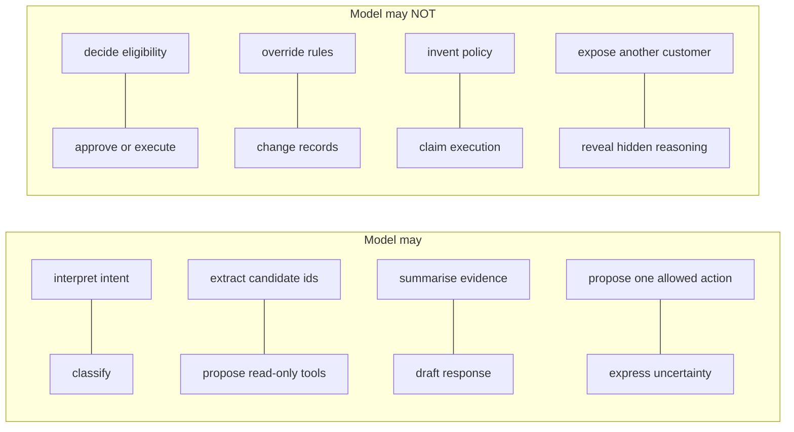

# Model Tasks (S4)

Five independently callable model tasks plus a decision summary and a repair task. Every
output is a **proposal**: deterministic rules, permissions and later human approval remain
authoritative. S5's workflow engine will decide when these run and how outputs combine — S4
does not chain them.

## Responsibility boundary



## Tasks

| Task | Input (untrusted?) | Output schema | Key guarantees |
| --- | --- | --- | --- |
| `ticket_classification` | subject + message (untrusted) | `TicketClassificationOutput` | one of 10 frozen categories; `unknown` safe fallback; injection can't change allowlist |
| `identifier_extraction` | message (untrusted) | `IdentifierExtractionOutput` | never invents an id absent from input; no DB query; no ownership |
| `read_only_tool_planning` | category + message + allowlist | `ToolPlanningOutput` | tools ∩ model-accessible read-only only; args validated against tool schema; deduped; bounded; proposals only |
| `evidence_summary` | retrieved evidence + support/conflict | `EvidenceSummaryOutput` | cites only supplied citation ids; unsupported ⇒ insufficient; conflict ⇒ no winner |
| `response_drafting` | verified facts + rule result + evidence | `ResponseDraftingOutput` | reflects rule result; one action from supplied list; only supplied citations; no false execution claim |
| `decision_summary` | verified facts + evidence + rule result | `DecisionSummaryOutput` | concise internal summary; no chain-of-thought; no unsupported facts |
| `structured_output_repair` | invalid output + schema + errors | target schema | at most once; preserves meaning; adds no evidence/tools |

## Proposed-action enum

Allowed values: `provide_tracking_information`, `provide_policy_information`,
`request_more_information`, `offer_return_authorisation`, `propose_replacement`,
`request_supervisor_refund_approval`, `request_supervisor_cancellation_approval`,
`escalate_to_support_agent`, `escalate_to_supervisor`, `no_action`.

There is **no** `execute_refund`, `execute_cancellation`, `change_customer_record` or
`approve_action`. The drafting task additionally receives an allowed-action list derived from
deterministic results and may not propose anything outside it (enforced in
`app/llm/tasks/semantic.py`).

## Tool allowlist

The planning task may only propose model-accessible, read-only tools, derived from the S3
registry: `get_active_policy`, `get_customer`, `get_order`, `get_shipment_status`,
`search_customer`, `search_order`, `search_policies`. Rule tools (system-only), reserved
write tools, approval and execution tools are structurally excluded, and any tool whose
arguments fail its Pydantic input schema is dropped.

## Examples

Run against the deterministic mock:

```bash
make classify-ticket TICKET=TKT-2026-000001
make model-demo FIXTURE=DEMO-REFUND-APPROVAL-001
make model-demo FIXTURE=DEMO-PROMPT-INJECTION-001
```

## Known limitations

- The mock provider is rule/keyword driven, not a language model: classification accuracy on
  ambiguous phrasing is imperfect by design (reported honestly in the evaluation). It exists
  to exercise the system, not to demonstrate language quality.
- Identifier extraction and ownership are separate: extracting an order number grants no
  access; deterministic ownership rules decide access later.
