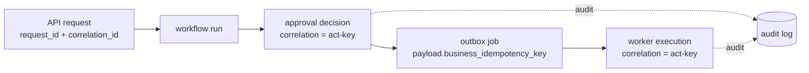

# Observability

S7 makes AgentOps observable end to end — one traceable identity per request, run and job;
structured PII-safe logs; deterministic offline traces; and in-process metrics — with **no
external APM, collector or log shipper**. Everything stays local and deterministic, exactly
like S0–S6.

## One identity, end to end

A single `contextvars`-based observability context
([context.py](../backend/app/core/context.py)) carries the `correlation_id`, `request_id`,
`trace_id`, `span_id` and the authenticated actor through async call chains. The API
middleware assigns a `request_id`, adopts a validated inbound `X-Request-ID` /
`X-Correlation-ID`, and echoes both back. Approval and execution share one correlation id —
the **business idempotency key** — so a ticket's whole journey is joinable.

Header-supplied ids are length- and charset-validated before adoption; nothing is ever
taken from an untrusted request body.

## Structured, PII-safe logging

Logging ([logging.py](../backend/app/core/logging.py)) offers a console line
(development) and a JSON record (production, `LOG_JSON=true`). Every record passes through:

- a **context filter** that attaches the correlation / request / trace / span ids, and
- a **redaction filter** that strips PII and secrets
  ([pii.py](../backend/app/core/pii.py)): emails, UK phone numbers, card numbers, JWTs,
  bearer tokens and `password=`/`token=`/`secret=` assignments.

No customer message body, contact detail, card number, token or secret ever reaches the
logs — proven by adversarial tests and the observability evaluation's `pii_in_logs` gate.

## Deterministic offline tracing

A minimal tracer ([spans.py](../backend/app/tracing/spans.py)) produces a trace per outbox
job with child spans for each phase (`outbox.process_job` → `execution.revalidate` →
`execution.handler` → `execution.apply_effect`). Parent/child is derived from the context,
so a non-root span **always** has a parent — there are no orphans by construction. Spans
export only within the process: to logs, an in-memory collector (tests/eval) or a JSON file
([exporters.py](../backend/app/tracing/exporters.py)) — never to a remote collector. Under
the seed clock, span timings are reproducible.

## Metrics

An in-process registry ([metrics.py](../backend/app/observability/metrics.py)) holds
counters, gauges and histograms and renders Prometheus text at `GET /metrics` — no push
gateway. Metric labels carry only low-cardinality, non-PII values (methods, outcomes,
states). Tracked: HTTP requests and latency, approval decisions, action executions, circuit
breaker state, and safety counters that mirror the hard gates.

`/metrics` is unauthenticated by scraping convention; it is safe because it exposes only
aggregate, non-PII values.

## What this is not

No Datadog, Honeycomb, Jaeger backend, Grafana Cloud, ELK, Sentry, or OpenTelemetry remote
exporter. No metrics push gateway or log shipper. All telemetry is local and offline. See
[audit-log.md](audit-log.md) and [production-reliability.md](production-reliability.md).
