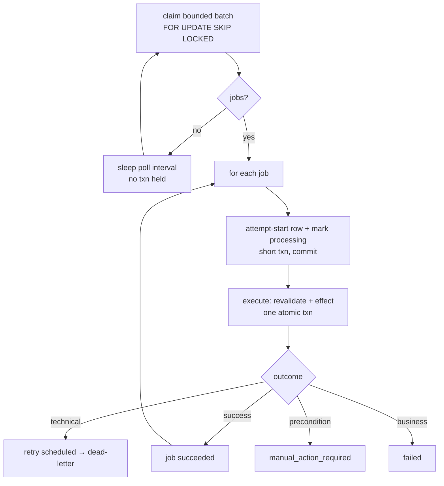

# The outbox worker

Approved actions are not executed inside the approval request. They are written to a durable
PostgreSQL **outbox** and executed later by a dedicated worker process. This decouples the
human decision from the (simulated) side effect, survives restarts, and makes exactly-once
delivery tractable.

## Why an outbox

An approval and its side effect must be atomic — you must never end up with an approval and
no queued work, or queued work with no approval. Writing the job **in the same transaction**
as the approval decision ([approval-system.md](approval-system.md)) gives that atomicity
without a distributed transaction across a queue broker. No Redis, Celery, Kafka or Temporal
is involved; the queue is a table.

## The job

`outbox_jobs` ([outbox.py](../backend/app/models/outbox.py)) holds one row per approved
executable action: the typed, hashed payload
([payload.py](../backend/app/outbox/payload.py)), the business idempotency key, status,
priority, attempt counters, `next_attempt_at`, and lease fields. The payload is PII-safe —
identifiers and hashes only, never the customer's message or full policy text — and an
unsupported payload version fails safe rather than executing.

## Claiming and leases

Workers claim with `SELECT … FOR UPDATE SKIP LOCKED` so competing workers never contend for
the same row ([repository.py](../backend/app/outbox/repository.py)):

```sql
SELECT * FROM outbox_jobs
WHERE status IN ('pending','retry_scheduled','claimed','processing')
  AND next_attempt_at <= now()
  AND (lease_expires_at IS NULL OR lease_expires_at <= now())
ORDER BY priority DESC, next_attempt_at ASC, created_at ASC, id ASC
LIMIT :batch FOR UPDATE SKIP LOCKED;
```

A claim leases the job for `OUTBOX_LEASE_SECONDS`. A crashed worker's lease simply expires
and the job becomes claimable again — safe reclamation, no manual intervention. Terminal
jobs (succeeded, dead-letter, cancelled, failed) are never claimed.

## The loop



The worker ([worker.py](../backend/app/outbox/worker.py)) has **no HTTP server and no
exposed port**. It holds no transaction while sleeping, recovers safely after termination,
traps `SIGTERM`/`SIGINT` for graceful shutdown, and never approves anything. Logs carry job,
worker and attempt ids and exclude PII and secrets.

## Attempt history

Every attempt appends an immutable `outbox_attempts` row
([outbox_attempt.py](../backend/app/models/outbox_attempt.py)) with worker id, previous and
result status, error code, retryable flag and duration. A succeeded job has exactly one
successful attempt; a dead-lettered job's history explains every prior failure.

## Retry and dead-letter

Retryable technical failures back off with bounded, jittered exponential delay
([retry.py](../backend/app/outbox/retry.py)); the jitter is deterministic per (job, attempt)
so retries stay reproducible. After `OUTBOX_MAX_ATTEMPTS` the job is **dead-lettered** — not
deleted — the approval is marked `execution_failed`, and the workflow pauses at
`action_failed`. A Supervisor can then authorise a retry (technical failures only). See
[action-execution.md](action-execution.md#failure-classification).

## Running it

```bash
python -m app.outbox.worker          # the loop
python -m app.outbox.cli list        # inspect the queue
python -m app.outbox.cli stats       # counts by status
python -m app.outbox.cli process-one # one tick, for demos
python -m app.outbox.cli attempts <job-id>
python -m app.outbox.cli release-expired-leases
```

In Docker Compose the `worker` service runs `python -m app.outbox.worker`, waits for a
healthy database and the backend (so it never races Alembic), has no exposed port, and
restarts safely. Stopping and restarting only the worker never loses or duplicates a job —
its lease expires and the job is reclaimed.
