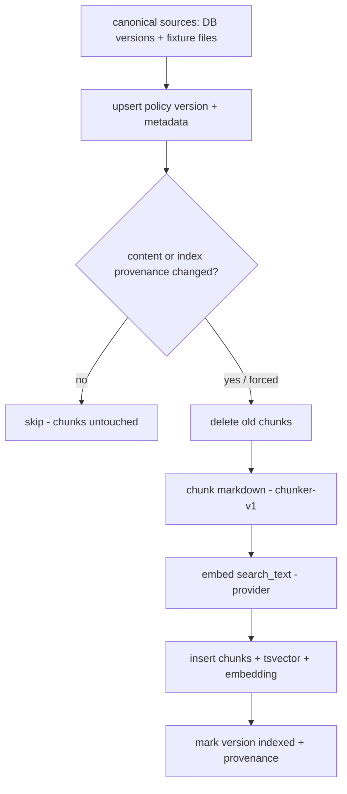

# Policy Indexing (S3)

Deterministic, idempotent ingestion that turns canonical policy documents into immutable,
searchable `policy_chunks`.



## Canonical source format

- **Official policies**: `data/policies/*.md` (returns, refunds, cancellations, delivery
  delays, missing deliveries, damaged items, incorrect items, privacy verification). The
  S1 seed loads these bodies into `policy_versions`; S3 ingestion indexes those versions.
- **Isolated fixtures**: `data/policies/fixtures/*.md` with YAML-style front matter
  (`topic, title, version, status, effective_from, source_type`). Currently a
  `hostile_fixture` (prompt-injection content) and a future-dated policy. These live in a
  separate directory so official policy is never confused with hostile/test content.

Each version carries `source_type` (`official_policy`, `historical_policy`,
`test_conflict`, `hostile_fixture`, `untrusted_external`), `source_path`, `content_hash`,
`language`, `jurisdiction`, `audience`, `is_retrieval_enabled` and `metadata_json`.

## Chunking strategy (`chunker-v1`)

Markdown-structure-aware, not a blind character splitter:

- Splits on heading hierarchy; `section_path` preserves it (e.g. `Returns Policy >
  Conditions`), de-duplicating a repeated title.
- Groups blank-line-separated blocks (paragraphs, bullet/numbered lists) and **never
  splits a single block**, so a numbered rule is never cut in half.
- Greedily packs blocks up to **800 characters**; a trailing chunk under **120
  characters** is merged into the previous chunk (short-section handling).
- `body` is the exact excerpt; `search_text` prepends the section path (heading context)
  and is used for both full-text and embedding. Output is deterministic for identical
  input; `content_hash` is a SHA-256 of the body.

## Embedding providers

- `deterministic_hash` (default) — a reproducible hashed bag-of-words at **dimension 256**;
  no model download, no network; used in CI and tests. Weak semantic quality by design.
- Optional `sentence_transformers` / `ollama` — never required, never auto-downloaded in
  tests; selecting them while unavailable fails clearly.

## Index compatibility and versioning

Each version records `embedding_provider`, `embedding_model`, `embedding_dim`,
`chunker_version` (`chunker-v1`), `index_schema_version` (`retrieval-index-v1`),
`content_hash` and `indexed_at`. Reindexing is triggered when the source content, chunker,
embedding provider/model/dimension or schema changes (or `--force`). Otherwise unchanged
versions are **skipped** — never silently deleted and recreated. The vector dimension is
fixed at **256** for the active index (`app.models.policy.EMBEDDING_DIM`).

## Database schema

`policy_chunks`: UUID PK, FK to `policy_versions` (cascade), `chunk_index`, `section_path`,
`heading`, `body`, `search_text`, `search_vector` (generated `tsvector`, GIN index),
`embedding` (`vector(256)`, HNSW cosine index), `token_count`, `character_count`,
`content_hash`, `citation_id` (unique), `metadata_json`. Unique `(policy_version_id,
chunk_index)` keeps chunks stable.

## Commands

```bash
make index-policies        # idempotent index
make reindex-policies      # force full reindex
make policy-index-stats    # per-version chunk counts
make verify-policy-index   # non-zero if any active official version is unindexed/incompatible
```

## Troubleshooting

- **"type vector does not exist"** — the pgvector extension is missing; migrations enable
  it, and tests create it before `create_all`.
- **`verify` reports "incompatible index"** — the embedding provider/model/dimension or
  chunker/schema version changed; run `make reindex-policies`.
- **Chunks not updating** — ordinary `index` skips unchanged sources; use
  `reindex-policies` to force.
