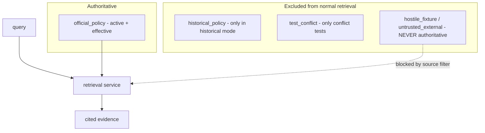
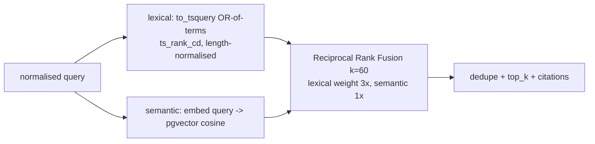

# Policy Retrieval (S3)

Version-aware hybrid retrieval that turns Meridian & Co.'s policy documents into cited
evidence. It **retrieves and cites**; it does **not** generate a customer answer (that is
a later stage). The deterministic retrieval + S2 policy-validity layers remain the
authority for which policy is active, whether policies conflict, and whether evidence is
current — a later AI may use the citations but never overrides these decisions.

## Trust boundary

Normal (model-facing) retrieval searches only `official_policy`. `historical_policy` is
added only in explicit historical mode; `test_conflict` only in conflict tests;
`hostile_fixture`/`untrusted_external` are **never** authoritative. A model-facing caller
(`search_policies`) cannot widen these — the tool input has no source or historical field.

## Query preparation

Deterministic, no LLM: Unicode NFKC + whitespace normalisation, and stripping obvious
injection wrappers (e.g. a leading "ignore all previous instructions"). Meaning-bearing
words (`not`, `after`, `before`, `within`, `without`, `delivered`) are **never** removed.
The original query is preserved alongside the normalised query.

## Lexical, semantic and hybrid

- **Lexical** — Postgres full-text over the chunk `search_vector` (a generated `tsvector`
  of heading-contextualised text). OR-of-terms for recall; `ts_rank_cd` with length
  normalisation to avoid long-document bias; deterministic tie-break on citation id.
- **Semantic** — pgvector cosine distance; score = `1 - cosine_distance` in `[0, 1]`.
- **Hybrid** — Reciprocal Rank Fusion (`fused = Σ weight / (60 + rank)`), lexical weighted
  higher because the default deterministic-hash embedding is a weak semantic signal.
  Individual lexical/semantic/hybrid ranks and scores are all returned; the channel used
  is reported and degraded (lexical-only) fallback is flagged, never hidden.

## Policy filtering

Applied inside the SQL query (a caller cannot widen it): retrieval-enabled flag, source
types, and — unless historical mode — status `active` and effective on `as_of`. Expired,
superseded and future versions are excluded from normal retrieval.

## Evidence and citation model

Each `PolicyEvidenceItem` carries the citation id, policy/version ids, title, topic,
version, status, effective dates, chunk id, section path, heading, the **exact** stored
excerpt (never paraphrased), content hash, and per-channel ranks/scores. Citation ids are
deterministic: `POL-<TOPIC>:v<version>:<section-slug>:chunk-<NN>`, e.g.
`POL-RETURNS:v2:returns-policy:chunk-00`. A later AI references these ids directly.

## Support and conflict

`support_status` is one of `supported`, `partially_supported`, `unsupported`,
`conflicting`, `no_active_policy`, `retrieval_degraded`. This is **not** entailment — it
only reports that current, sufficiently relevant evidence was retrieved under thresholds;
a human or later grounded step decides the answer. Conflicts are detected with the S2
policy-validity rule (multiple active versions for a topic → `conflicting`); the highest
score is never silently chosen, and consequential-action support is denied.

## Unsupported queries

Out-of-domain queries (warranty, international shipping, subscriptions) return
`unsupported` when no strong lexical match and no sufficiently similar semantic result
exists. This is a deterministic limitation, not natural-language understanding.

## Security boundaries

All retrieved text is data, never instructions. Hostile fixtures are indexed only in an
isolated `hostile_fixture` source and are excluded from authoritative retrieval; embedded
"ignore previous instructions", fake tool-call JSON and fake authorisations have no effect
because nothing in retrieval executes document text. Logs record correlation id, mode,
query length, counts, support/conflict and duration — never raw PII, embeddings or full
policy bodies.

## Tool integration

`search_policies` (model-facing, `policy_read`, read-only): input `query`, optional
`topic`, `top_k`; output citations + support/conflict status + warnings + mode used. It
never exposes source overrides, historical mode, raw vectors, full internal metadata or
whole documents. The S2 `get_active_policy` and `validate_policy_versions` tools remain.

## Limitations

- The default embedding is a deterministic hashed bag-of-words (for offline/CI
  reproducibility); semantic quality is weak and lexical is the stronger channel — see
  [retrieval-evaluation.md](retrieval-evaluation.md). An optional local provider (Sentence
  Transformers / Ollama) can be enabled but is never required.
- No answer generation, RAG prompt assembly or LLM grounding yet (S4+).
