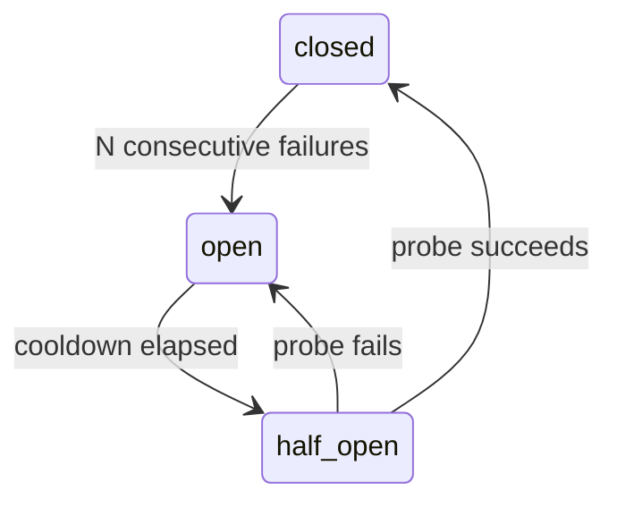

# Production reliability

S7 hardens the API and worker against timeout, overload, dependency failure and shutdown —
without any external dependency.

## Reliability middleware

One middleware ([middleware.py](../backend/app/api/middleware.py)) runs outermost on every
request and provides:

- **Request id + correlation context** — assign/adopt/echo `X-Request-ID` and
  `X-Correlation-ID`; bind the observability context for the whole request.
- **Request-size limit** — reject oversized requests with `413`.
- **Per-request timeout** — a slow request returns a clean `504` rather than hanging.
- **Rate limiting** — a per-client fixed window returns `429` when exceeded.
- **Structured error envelope** — every error returns `{code, message, request_id}` with no
  stack trace and no PII.
- **HTTP metrics** — request counter and latency histogram.

## Liveness vs readiness

`/health/live` reports process liveness only (never touches dependencies).
`/health/ready` verifies **two** things and returns `503` if either fails
([health.py](../backend/app/api/routes/health.py)): the database is reachable **and**
migrations have been applied (a reachable but un-migrated database is not ready). The worker
logs a heartbeat on start and drains its current tick on `SIGTERM`.

## Provider circuit breaker

The model provider layer is wrapped in a circuit breaker
([circuit_breaker.py](../backend/app/observability/circuit_breaker.py)) per provider:

When a provider's breaker is open the router skips it and falls through to the next
candidate — ultimately the deterministic mock — so the system never hard-fails. Breaker
state is exposed as a metric, never as a business audit event. Explicit per-call timeouts
and the existing bounded retries / fallback order round out provider resilience.

## Graceful shutdown & recovery

The API uses FastAPI's lifespan to dispose the engine cleanly. The worker traps
`SIGINT`/`SIGTERM`, holds no transaction while sleeping, and — because outbox leases expire
and jobs are safely reclaimed (see [outbox-worker.md](outbox-worker.md)) — a restart never
loses or duplicates a job.

## Retention and SLOs

Configurable retention windows govern how long logs are kept; audit events are retained for
their (longer) window and never deleted within it. Log files rotate by size/age at the
deployment layer.

Documented SLOs (targets, no external alerting integration):

| SLO | Target | Signal |
| --- | --- | --- |
| API availability | `/health/ready` 200 | readiness probe |
| Approval-decision latency | p95 < 1s | `agentops_http_request_seconds` |
| Outbox processing lag | due jobs drained < 1 min | `agentops_outbox_jobs_total`, queue depth |
| Execution success rate | ≥ 99% (excl. business blocks) | `agentops_action_executions_total` |
| Safety | **all hard-gate counters = 0** | `agentops_unsafe_outcomes_total` |

Alert *signals* are log- and metric-based; wiring them to a pager or webhook is a
deployment concern and is intentionally **not** built here (no PagerDuty, Opsgenie, email or
external webhook). See [observability.md](observability.md).
