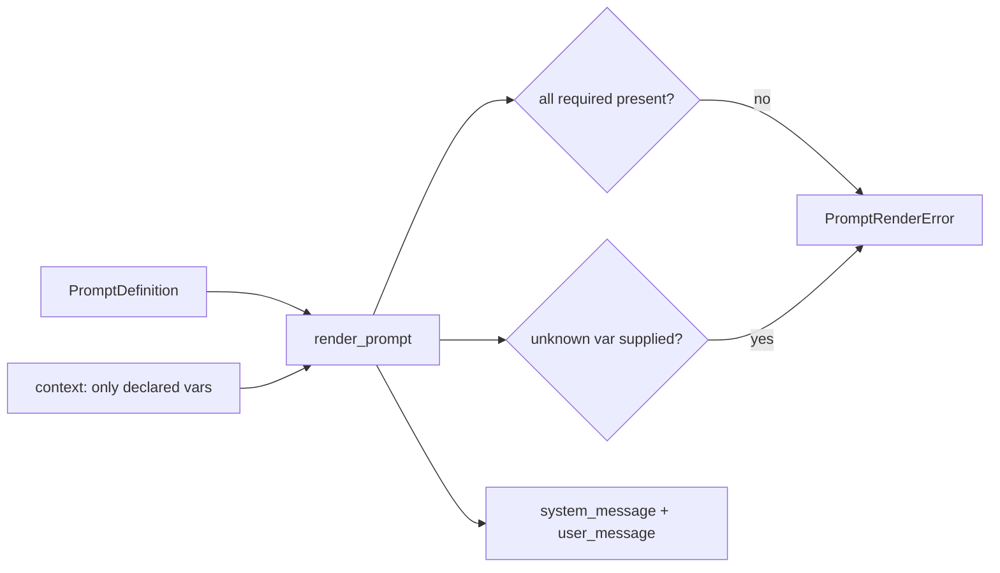
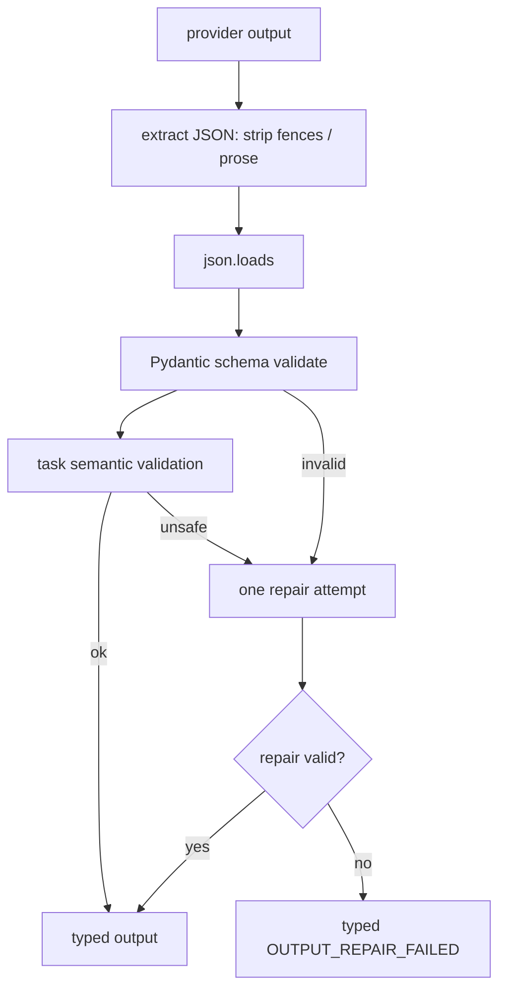

# Prompt System (S4)

Versioned, hashable, immutable prompts that separate trusted instructions from untrusted
data. Prompts live in canonical YAML, never buried in service methods.

## Source structure

```text
backend/app/prompts/
├── models.py       # PromptDefinition + deterministic template_hash
├── loader.py       # load + validate YAML templates
├── validation.py   # structural validation (declared vars, non-empty, bounds)
├── renderer.py     # safe {{ var }} substitution, no code execution
├── registry.py     # resolve by name / active-per-task
├── cli.py          # (via app.llm.cli) list-prompts / show-prompt
└── templates/<task>/<version>.yaml   # 7 tasks, version 1.0.0
```

Each definition declares: name, semantic version, task type, status, system/user templates,
input/output schema names, required context fields, allowed tools, limits, default
temperature, description and security notes.

## Versioning and immutability

- Unique `(name, semantic_version)`; the on-disk directory and filename must match the
  declared task and version.
- Exactly one **active** version per prompt name (enforced by the registry).
- The DB `prompt_versions` row is written from source on first use and never mutated, so a
  model call references the exact text and hash used.

## Deterministic hashes

`template_hash` is a SHA-256 over the canonical, order-independent hash-relevant content
(name, version, task, both templates, schema names, sorted required fields and tools,
limits, temperature). Stable for identical content; the persisted row's hash proves what
was rendered.

## Rendering and input boundaries



The only templating construct is `{{ field }}` substitution — no conditionals, loops,
attribute access or expressions, so a template can never execute code. Rendering fails on a
missing required variable and rejects unknown variables.

## Prompt-injection treatment

Every task prompt separates trusted system instructions, deterministic rule results, official
policy evidence and untrusted customer content using labelled XML-like blocks:

```text
<customer_message trust="untrusted"> … </customer_message>
<policy_evidence trust="official"> … </policy_evidence>
<business_rule_result authority="deterministic"> … </business_rule_result>
```

Customer content is never concatenated into system instructions — it is only placed inside
an untrusted block. Templates state that untrusted content is data. Tool-call JSON in
customer text stays inert. Prompts never ask the model to "think step by step" and never
request or store hidden chain-of-thought — only a concise `decision_summary`. These markers
are representational, not a complete defence; the semantic-validation layer is the real
enforcement.

## Structured-output schemas and repair



Repair receives only the target task name, output schema, invalid raw output and validation
errors — no extra business context. It runs **at most once**, is recorded separately, and
must not invent evidence, alter rule results or add tools outside the allowlist. It never
loops until something happens to validate.
