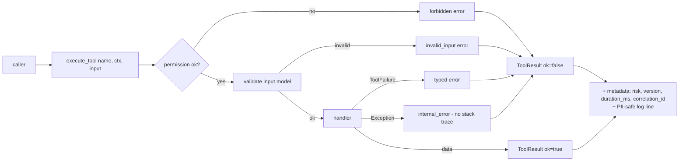
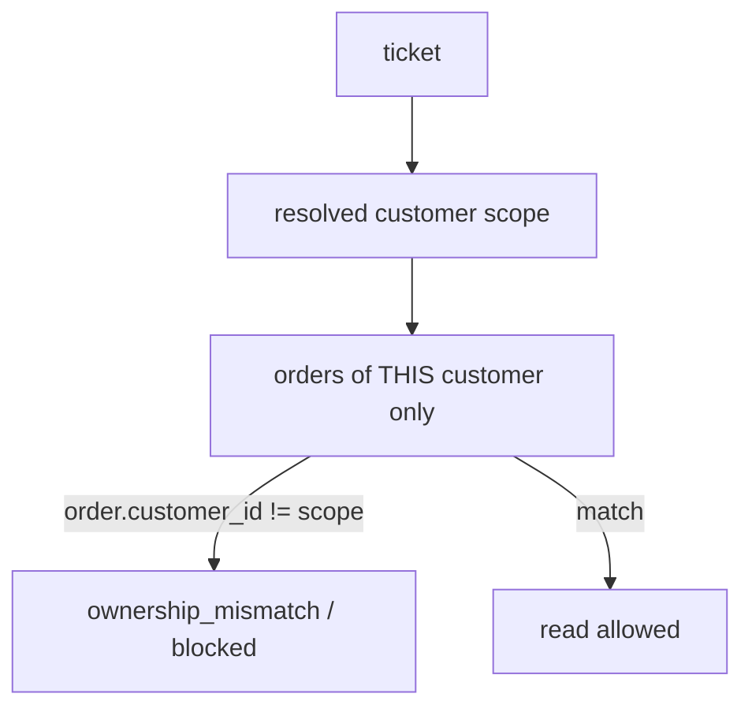

# Tool System (S2)

Tools are the strictly-typed, least-privilege surface through which the future workflow
reaches the domain and the rules engine. Every tool is described by metadata and runs
through one executor that enforces permissions, times the call, and converts failures
into typed errors.

## Tool context

`ToolContext` (`app/tools/context.py`) carries only what tools need: `permissions`,
`clock`, `session?`, `actor`, `customer_scope?`, `ticket_id?`, `correlation_id`,
`timeout_ms`. No LLM state; no global mutable state. `require_permission` raises
`forbidden`; `customer_scope` enables ownership scoping so a ticket workflow can never
search outside its resolved customer.

## Permission model

Separate from future JWT auth. Permissions: `customer_read, order_read, shipment_read,
policy_read, rules_execute, internal_tool_inspect`. A missing permission yields a
`forbidden` result. **No write or execute permission exists in S2.**

## Registry

`ToolDefinition` exposes: name, description, input/output Pydantic models (and generated
JSON schema), required permission, risk level, read-only flag, approval requirement,
version, `model_accessible`, timeout, retry policy and handler. The registry is
inspectable without executing anything (`list_tools`, `get_tool`, `schema`).

**Read-only, model-facing:** `search_customer`, `get_customer`, `search_order`,
`get_order`, `get_shipment_status`, `get_active_policy`.

**Deterministic rule tools (system-facing, `model_accessible=false`):** `check_ownership`,
`check_return_eligibility`, `check_refund_eligibility`, `calculate_refund_limit`,
`check_cancellation_eligibility`, `classify_delivery_delay`, `check_missing_delivery`,
`check_damaged_item_remedy`, `check_incorrect_item_remedy`, `calculate_risk_and_route`,
`generate_idempotency_key`, plus `validate_policy_versions`.

**Reserved (no handler in S2, cannot execute):** `create_approval_request`,
`update_ticket_status`, `execute_simulated_refund`, `execute_simulated_cancellation`,
`record_audit_event`. Semantic `search_policies` belongs to S3.

## Result and error envelopes

`ToolResult[T]` (Pydantic v2 generic, `SerializeAsAny` on `data`): `ok`, `tool`, `data`,
`error`, `metadata{risk_level, tool_version, duration_ms, correlation_id}`. Errors use a
stable `ToolErrorCode` and a `retryable` flag, and never contain a stack trace. Codes
distinguish business outcomes (`not_found`, `ambiguous_match`, `invalid_state`,
`policy_*`, `duplicate_action`), security (`ownership_mismatch`, `forbidden`) and
technical failures (`tool_timeout`, `dependency_unavailable`, `internal_error`).

## PII-safe behaviour

Customer summaries are masked (`j***@example.com`, `*******3456`); password hashes are
never present in any schema or result. Logs contain only tool name, correlation id,
duration, success and error code — never message bodies, emails, phone numbers or full
policy bodies. `app/core/pii.py` provides `mask_email`, `mask_phone` and `redact_pii`.

## Timeouts and retries

Metadata, not a framework (no Celery/Redis/Temporal). Pure rule tools: 0 retries.
Repository reads: at most one retry, and only on a **transient** DB error
(`OperationalError`). Not-found, ambiguity, ineligibility, forbidden and ownership
violations are never retried; repeated failures are never hidden.

## JSON-schema generation

`ToolDefinition.input_schema()` / `output_schema()` return `model_json_schema()` for
each Pydantic model — the basis for future model-facing tool declarations.

## Future integration

The workflow engine (S5) will resolve a customer scope, call read-only tools to gather
evidence, call rule tools for the authoritative decision, and — only after a persisted
Supervisor approval (S6) — invoke the reserved execute tools through the durable outbox.
The envelope, permissions and idempotency utility are designed to carry through
unchanged.
