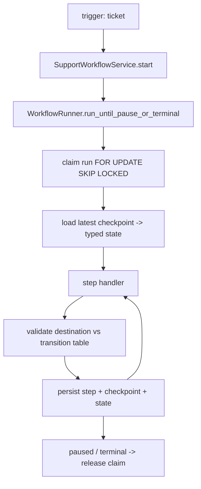

# Workflow Engine (S5)

Composes the S2 rules, S2 tools, S3 retrieval and S4 model tasks into an explicit, durable,
resumable and replayable support-ticket workflow that safely reaches a human-review,
approval, escalation, needs-information or terminal boundary. **The engine orchestrates; it
is not the authority** — the deterministic `inspect_ticket` layer decides ownership,
eligibility, risk and route, and **no consequential action is executed in S5**.

## Architecture



- **Service** (`app/workflows/service.py`): `start`, `run`, `resume`, `cancel`, `replay`.
  Owns the session factory and execution context; keeps routes/CLI thin.
- **Runner** (`app/workflows/runner.py`): claims a run, loads the last valid checkpoint,
  executes one step at a time, validates each destination against the transition table, and
  persists step + checkpoint + state until a pause/terminal state, a step limit, or the
  total deadline.
- **Handlers** (`app/workflows/handlers.py`): twelve pure orchestration steps. Each returns
  a typed `StepExecutionResult` (state fragment + destination + provenance) and may never
  choose a step outside its declared transitions.
- **Repository** (`app/workflows/repository.py`): async persistence for runs, checkpoints,
  steps, tool calls and proposed actions.

## Handler interface

```python
class StepHandler(Protocol):
    async def __call__(
        self, ctx: WorkflowExecutionContext, state: SupportWorkflowState
    ) -> StepExecutionResult: ...
```

## Execution context

`WorkflowExecutionContext` injects everything explicitly (no global mutable state): async
session, correlation id, worker id, clock (the **seed-reference clock** so date rules are
reproducible), model service, provider preference, limits, and the current run/step ids used
to link model and tool calls.

## Transaction boundaries

The engine never holds a transaction open across a slow model call:

1. Persist **step started** and `commit()` — before any external/model work.
2. Run the handler (model/tool/retrieval/rules).
3. Persist **step completed + checkpoint + run-state** and `commit()` — atomically.

A crash after step 1 but before step 3 leaves a `started` step and the last valid committed
checkpoint; resume continues from that checkpoint (read-only work may safely repeat).

## Concurrency control

Lease-based claiming with row locking (no Redis): `SELECT ... FOR UPDATE SKIP LOCKED` means a
competing worker skips a locked row and returns `None`. A claim carries a time-bounded lease
and bumps an optimistic `lock_version`; paused and terminal runs are never claimable, and an
expired lease is reclaimable. A partial unique index enforces **at most one non-terminal run
per ticket** (replay runs exempt).

## Limits

Configurable via `WorkflowLimits`: max steps per invocation (20), total deadline (120 s),
per-step timeout, max evidence citations, and claim lease seconds. Exceeding the deadline
persists state, releases the claim and moves to a safe terminal failure.
