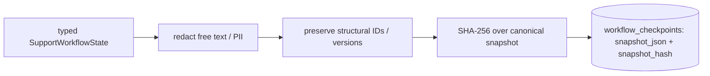

# Workflow Recovery: Checkpoints, Resume & Concurrency (S5)

## Checkpoint design

A checkpoint is an **immutable, redacted, hashed** snapshot of workflow state at a step
boundary. One is written after workflow creation (step 0), after every completed step, and
on every transition to a paused/terminal state. Unique on `(workflow_run_id, step_index)`.



## Snapshot schema & hashing

The snapshot is `SupportWorkflowState.model_dump(mode="json")` carrying a
`state_schema_version` (`workflow-state-v1`). Redaction removes customer PII/secrets from
free text and nested content, but **structural identity fields** (run/ticket ids, references,
enums, versions, citation/model/tool-call id lists) are preserved verbatim so a card/phone
digit-run inside a UUID can never corrupt it. The hash is a SHA-256 over the canonical
(sorted-key) redacted snapshot.

## Resume

```python
async def resume(request: ResumeWorkflowRequest) -> WorkflowRunResult: ...
```

1. Reject terminal runs. 2. Reject paused runs unless an explicit reason is supplied.
3. Load the latest checkpoint. 4. **Verify the hash** and schema version (a tampered snapshot
or unsupported schema is rejected). 5. Rebuild the typed state. 6. Increment `resume_count`
and record the reason. 7. Continue from the next valid transition. Completed read-only work
may safely repeat; no consequential write is ever repeated (none exists in S5).

## Crash scenarios

| Crash point | Recovery |
| --- | --- |
| Before a step starts | Re-run from the last checkpoint. |
| After "step started" persisted | The `started` step is orphaned; the last committed checkpoint is authoritative and the step re-runs. |
| After a model/tool call, before completion | The call is recorded; re-running read-only work is safe (input hashes match). |
| After checkpoint, before run-state update | The checkpoint is authoritative; state is reconciled from it. |

The **latest valid committed checkpoint is always authoritative** — a step is never inferred
complete from an in-memory result. No outbox is introduced in S5.

## Claims & leases

A run is claimed with `FOR UPDATE SKIP LOCKED` plus a time-bounded lease and an optimistic
`lock_version`. Only one worker can advance a run at a time; a second worker's `claim` returns
`None`. Paused/terminal runs are not claimable; an expired lease is reclaimable. A partial
unique index prevents two active runs per ticket, so duplicate triggers return the existing
run.

## Retry & timeout policy

- Pure validation/rules: no retry. Database reads: one retry for transient failures.
- Retrieval: up to two attempts for transient infrastructure failure; **no** retry for
  unsupported/conflicting evidence.
- Model tasks: the S4 provider retry/fallback applies; the workflow adds at most one repeat
  for a retryable exhausted failure.
- Invalid business results are never retried — they route safely. Every retry increments the
  step attempt and is persisted, bounded by the total workflow deadline.
