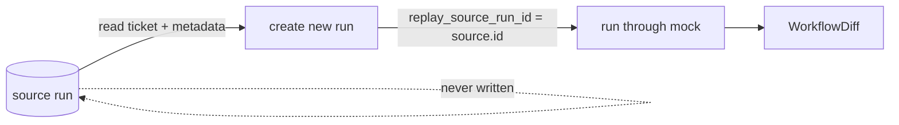

# Workflow Replay (S5)

Replay re-runs a ticket through a **new** workflow run linked to the source, and compares the
outcomes. The source run is never mutated, and replay never creates approvals or executes
actions.

## Modes

```text
recorded_outputs        reuse validated stored model outputs / tool snapshots where safe
deterministic_mock      re-run the deterministic mock provider (default)
current_configuration   re-run with the current prompt/model/rule/index versions (explicit)
```

Because the mock provider is deterministic, `deterministic_mock` reproduces the original
outcome exactly. `current_configuration` is explicit and clearly labelled; it is the only mode
that may diverge if configuration changed since the source run.

## Source immutability



A replay run has `trigger_type = replay` and `replay_source_run_id = source.id`; replay runs
are exempt from the one-active-run-per-ticket index so they never collide with a paused source.

## Output diff

`WorkflowDiff` compares the source and replay on: final `state`, `status`, `classification`,
resolved customer/order, `risk_level`, `recommended_route`, `proposed_action`,
`approval_required`, `failure_code` and `step_count`. `diff.identical` is true when every
compared field matches. (Subjective natural-language similarity is intentionally not scored.)

## Safety constraints

- The source run is read-only during replay.
- Replays create no proposed-action approvals and execute nothing.
- Deterministic-mock replays are reproducible run-to-run.
- Reports are not compared as if mock output were real language quality.

## Commands

```bash
make workflow-replay RUN=<uuid>
python -m app.workflows.cli replay <run-id> --mode deterministic_mock
```

## Limitations

`recorded_outputs` currently re-runs the deterministic mock (which reproduces the stored
outputs) rather than materialising them from storage; the distinction matters only for real
providers, which are out of scope for CI.
