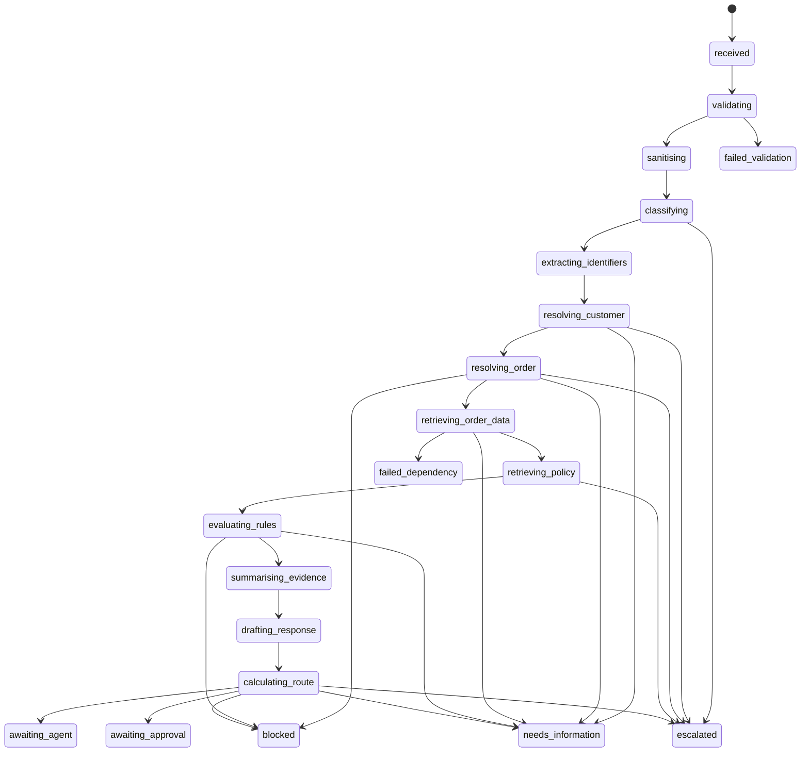

# Workflow State Machine (S5)

`support-ticket-v1` is an explicit, versioned state machine. Branches are chosen by step
handlers from **typed results** (never arbitrary model text), and every produced destination
is validated against the transition table before it is persisted. Invalid transitions
terminate the run safely.

## State catalogue

| Partition | States |
| --- | --- |
| **Active** (processing) | `received`, `validating`, `sanitising`, `classifying`, `extracting_identifiers`, `resolving_customer`, `resolving_order`, `retrieving_order_data`, `retrieving_policy`, `evaluating_rules`, `summarising_evidence`, `drafting_response`, `calculating_route` |
| **Paused** (awaits a human/external event) | `awaiting_agent`, `awaiting_approval`, `needs_information`, `escalated` |
| **Terminal** (cannot continue automatically) | `blocked`, `failed_validation`, `failed_dependency`, `failed_model`, `cancelled`, `resolved_without_action` |

There is **no** `executing_refund` / `executing_cancellation` state — consequential
execution is S6. The partition is disjoint and complete (property-tested).

## Status catalogue

`pending`, `running`, `paused`, `completed`, `failed`, `cancelled`. Status is derived from
state so the two never disagree (e.g. state `awaiting_approval` ⇒ status `paused`; state
`blocked` ⇒ status `failed`; `resolved_without_action` ⇒ `completed`; `cancelled` ⇒
`cancelled`).

## Transition diagram

## Entry / exit conditions (branch drivers)

- **resolve_customer** → `needs_information` if the customer cannot be resolved.
- **resolve_order** → `blocked` on a cross-customer ownership mismatch (the other customer's
  order is never revealed); `needs_information` if no order and the category needs one.
- **retrieve_policy** → `escalated` on a policy conflict (never silently resolved) or an
  unsupported consequential policy claim.
- **evaluate_rules** → `blocked` on an ownership block; `needs_information` if the
  deterministic route needs more facts.
- **calculate_route** maps the deterministic `Route` to the final state: `await_agent` →
  `awaiting_agent`, `await_supervisor` → `awaiting_approval`, `needs_information` →
  `needs_information`, `escalate`/`manual_handling` → `escalated`, `blocked` → `blocked`.

## Invalid transitions

`is_valid_transition(source, dest)` gates every destination. A handler that produces an
illegal edge fails the step and terminates the run as `failed_dependency` (internal error).
Paused and terminal states have no outgoing edges (enforced at module load and property-
tested).
